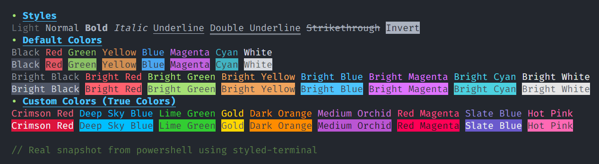

<h1 align="center">
	<br>
	
	<br>
	<br>
</h1>

> A fast, lightweight, and high-performance terminal string styling library.

[![NPM Downloads][downloads-image]][downloads-url]
[](https://www.npmjs.com/package/styled-terminal?activeTab=dependents)
[![NPM Version][npm-image]][npm-url]



## Features

- Supports a wide range of color formats, including 8-bit, 256-bit, RGB, HSL, and HEX.
- Modular design enables the creation of color palettes and reusable styles.
- Does not extend `String.prototype`
- Minimize's string pollution.
- Ability to nest styles
- Lightweight `< 40Kb`.
- Highly performant.
- No dependencies.
- Expressive.
- Maintained.
- Robust.

## Support

| Platform / Terminal       | Type     | Supported | Support Since                |
| ------------------------- | -------- | --------- | ---------------------------- |
| **Windows Console (CMD)** | Terminal | ❌        | Not supported                |
| **Terminal.app (macOS)**  | Terminal | ✅        | Since early versions         |
| **PowerShell 6+**         | Terminal | ✅        | Since release                |
| **PowerShell 5.1+**       | Terminal | ✅        | Windows 10 v1511 (2016)      |
| **Windows Terminal**      | Terminal | ✅        | Since initial release (2019) |
| **GNOME Terminal**        | Terminal | ✅        | Since early versions         |
| **Linux Console**         | Terminal | ✅        | Since early versions         |
| **iTerm2 (macOS)**        | Terminal | ✅        | Since early versions         |
| **Konsole (KDE)**         | Terminal | ✅        | Since early versions         |
| **Chrome DevTools**       | Browser  | ✅        | Since version 69 (2018)      |
| **Cygwin Terminal**       | Terminal | ✅        | With ANSI support enabled    |
| **ConEmu**                | Terminal | ✅        | With ANSI support enabled    |
| **xterm**                 | Terminal | ✅        | Since early versions         |

## Installation

Installation is done using the
[`npm install` command](https://docs.npmjs.com/getting-started/installing-npm-packages-locally):

```bash
npm install styled-terminal
```

## Declaration

##### Using CommonJS (ES5)

```js
const { style } = require("styled-terminal");
```

##### Using ES Modules (ES6+)

```js
import { style } from "styled-terminal";
```

## Usage

#### 1. Hello World Example

```js
import { style, Color } from "styled-terminal";

// Prints "Hello World!" with a random foreground color.
console.log(style.fg(Color.random).apply("Hello World!"));
```

#### 2. Styled String Concatenation

```js
import { style, Color } from "styled-terminal";

// Standard concatenation of styled strings.
console.log(
  style.fg(Color.green).apply("• ") +
    style.fg(Color.blue).bold.underline.apply("Headline")
);

// Arguments concatenation of styled strings.
console.log(
  style.fg(Color.green).apply("•", " "),
  style.fg(Color.blue).bold.underline.apply("Headline")
);

// Nested concatenation of styled strings.
console.log(
  style
    .fg(Color.green)
    .apply("•", " ", style.fg(Color.blue).bold.underline.apply("Headline"))
);
```

#### 3. Define Custom Styles and Colors

```js
import { style, Color } from "styled-terminal";

// Custom Colors
const deepSkyBlue = Color.rgb(0, 191, 255);
const mediumOrchid = Color.hex("#BA55D3");
const hotPink = Color.hsl(330, 100, 17);
const darkOrange = Color.hex("#FF8C00");
const redMagenta = Color.hex("#ff0055");
const crimsonRed = Color.hex("#DC143C");
const limeGreen = Color.hex("#32CD32");
const slateBlue = Color.hex("#6A5ACD");
const gold = Color.hex("#FFD700");

// Custom Styles.
const headline = style.fg(deepSkyBlue).underline.bold;
const description = style.italic;
const highlight = style.fg(gold);

// Custom Style Function.
const codeComment = (comment) =>
  `${style.fg(Color.green).light.apply(`// `, comment)}`;

console.log(headline.apply("Headline"), highlight.bold.italic.apply("1"));
console.log(description.apply("A short description..."));

console.log(codeComment("A simple comment."));
```

## Author

[Liav Barsheshet, LBDevelopments](https://github.com/liavbarsheshet)

## License

[MIT](LICENSE)

[npm-image]: https://img.shields.io/npm/v/styled-terminal.svg
[npm-url]: https://www.npmjs.com/package/styled-terminal
[downloads-image]: https://img.shields.io/npm/dm/styled-terminal.svg
[downloads-url]: https://npmcharts.com/compare/styled-terminal?minimal=true
